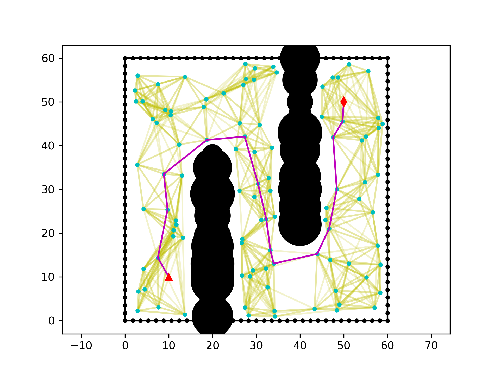

# An Exploration into PRM Maintenance in Dynamic 2D Environment
Studies how to maintain PRM algorithm in dynamic 2D (two-dimensional) environment, where obstacles 
occasionally get added to/deleted from the map.

This is a course project (_EE5058 - Introduction to Information Technology, Spring 2023_) in SUSTech, which features on enhancing 
existing sampling-based motion planning methods, specifically PRM and RRT. The author is purely a rookie in the area
of Sampling-based Motion Planning. Therefore, it is suggested to carefully examine the content and code before using.

## Introduction

### What is PRM
PRM stands for "Probabilistic Road Map". The PRM algorithm uses this sampled road map for motion planning. Essentially,
it samples a set of feasible points (do not collide with existing obstacles) on the map, construct connections among 
the sample points, and build up a graph-like road map. The aforementioned operations are performed offline in the 
setup phase. Then, it can utilize this road map to handle multiple queries. 

In the serving phase, each query contains a starting point and a goal point. The algorithm first checks whether either
of the provided starting point and goal point collides with existing obstacles. If not, it tries to connect each of the 
two points to the nearest feasible (reachable without collision) sample point in the road map. Finally, it utilizes a
shortest path algorithm (e.g., Dijkstra, A-Star) to find the shortest path between the two sample points.

It is worth noting that PRM has the following two important features:
1. Builds the road map offline at the setup phase.
2. Supports multi-query.

Below shows an example about how PRM operates in an environment and solves queries:

The red triangle and red diamond represents the starting point and the goal point, respectively. The black parts 
represent the obstacles. The road map constructed by PRM is represented as cyan points (nodes) and yellow solid lines
(edges). The purple lines represent the found feasible path for this query.

### Why Dynamic Environment Matters?
In most real-world scenarios, the environment robots operate in is not static. Obstacles change over time. As an 
example, in the mountains, there may be accidents that big rocks fall from the top and block the road. Such environment 
changes may malfunction the naive PRM algorithm, which builds the road map offline. As a result, it is necessary to
consider dynamic environment changes and maintain the road map at runtime.

### Assumption
This project assumes the following statements:
1. The robot operates on a 2D rectangle map, and is not expected to leave the map range. To simplify, the edge of the
map is surrounded by 1-unit point obstacles.
2. This project utilizes _[PythonRobotics](https://github.com/AtsushiSakai/PythonRobotics)_ and considers the robot 
as well as the obstacles as rounds (represented as `(x, y, r)`).

### Problems to Examine
In detail, it examines the following problems:
1. How to maintain PRM when new obstacles are added to the map, blocking several existing edges.
2. How to maintain PRM when existing obstacles are deleted from the map, sparing extra free space for motion planning.
3. (Optional) How to build a road map (like the one in PRM) in an online fashion, in order to amortize the setup time.

## Dynamic PRM

### Collision Checking: BVH
Now that obstacles are rounds rather than points, a simple obstacle KD Tree does not give the actual nearest obstacle.
To avoid brute force collision checking, other data structures should be considered. Here, we choose BVH (Bounding
Volume Hierarchy).

### New Obstacles Blocking Existing Edges
xxx

### Existing Obstacles Deleted
xxx
